# TimeForge — Phase 2: Architecture Blueprint

> Technical blueprint that every later phase must follow.
> Internal enterprise app · NestJS + Next.js · PostgreSQL (shared schema + `tenant_id`, RLS) · Redis/BullMQ · AI abstraction (default OpenAI)
> Status: **DRAFT — awaiting approval before Phase 3 (Database Design)**
> Scope guard: **diagrams and structure only — no business logic or implementation code.**

---

## Goal

Define the complete technical architecture for TimeForge: how the system is structured (Clean Architecture + DDD-lite in a modular monolith), how a request flows from the browser to the database and back, how tenant isolation is enforced as defense-in-depth, and how authentication, authorization, domain events, background jobs, AI, caching, logging, and deployment fit together. Everything is expressed as Mermaid diagrams plus concise rationale so Phases 3–9 have an unambiguous map to build against.

The detailed **physical** data model (columns, types, indexes, constraints, migrations) is intentionally deferred to **Phase 3**. Phase 2 includes only a **conceptual ERD** to show module data ownership and relationships.

---

## Assumptions

1. Builds directly on the approved Phase 1 Business Analysis (same actors, modules, rules, RBAC, and the internal-app scope with no commercial layer).
2. **Modular monolith** for the MVP: one deployable NestJS API + one worker process, organized into strict module boundaries that can later be extracted into services without rewrites.
3. Single primary **PostgreSQL** instance; single **Redis** (cache + BullMQ); one **S3-compatible** object store for attachments and generated exports.
4. **Prisma** is the ORM (the tenant-injection middleware lives here).
5. One runtime environment per deployment; horizontal scaling is by running more API/worker containers (stateless app tier).
6. Feature flags are a **future-ready seam**, not built in the MVP (per revised Phase 1 AD-11).
7. AI is async and assistive: AI calls run on a queue, never on the request hot path, and never mutate payroll/approvals automatically.

---

## Architecture Decisions

| # | Decision | Rationale |
|---|----------|-----------|
| AD2-1 | **Modular monolith** (NestJS), not microservices. | Right-sized for a 2-week MVP; module seams keep future service extraction cheap. |
| AD2-2 | **Clean Architecture + DDD-lite per module** — layers: `api` (presentation), `application` (use cases), `domain` (entities/events/interfaces), `infra` (Prisma/adapters). Dependencies point inward. | Maintainability, testability, SOLID; domain stays framework-agnostic. |
| AD2-3 | **Tenant isolation = 4-layer defense in depth**: JWT → request context → Prisma middleware filter → Postgres RLS. | Even if an app-level filter is missed, the DB still blocks cross-tenant access. |
| AD2-4 | **Separate worker process** sharing domain/application code; **BullMQ on Redis** for async work. | Keeps API latency low; isolates heavy AI/report jobs. |
| AD2-5 | **Redis** doubles as cache (`cache-manager`) and queue backend. | One dependency, two needs; tenant-scoped cache keys. |
| AD2-6 | **AuthN**: Passport JWT (short-lived access) + **rotating refresh tokens** (hashed, reuse-detected); **Argon2** hashing. | Strong, revocable sessions with theft detection. |
| AD2-7 | **AuthZ**: permission-based **guards + policy handlers** (`@RequirePermissions`, scope + policy checks). | Fine-grained, role-agnostic, default-deny. |
| AD2-8 | **Validation**: global `ValidationPipe` with `whitelist` + `forbidNonWhitelisted` + `transform`; class-validator DTOs; **Zod** for dynamic/AI payloads. | Strict input, rejects unknown fields, typed end-to-end. |
| AD2-9 | **Observability**: `pino` structured JSON logging, correlation/request IDs via AsyncLocalStorage, global exception filter with a standard error envelope. | Traceability; never leak stack traces. |
| AD2-10 | **Domain events** via in-process event bus; side effects (KPI, notifications, audit, AI) handled async (enqueued to BullMQ). | Decoupled modules; the approval path stays thin. |
| AD2-11 | **Monorepo** (`apps/api`, `apps/web`, `apps/worker`, `packages/shared`). | Shared types/contracts, single source of truth. |
| AD2-12 | **Conceptual ERD in Phase 2; physical ERD + migrations in Phase 3.** | Avoids duplicating the data-design phase. |
| AD2-13 | **Explicit state machines**; invalid transitions rejected at the application layer before persistence. | Predictable, auditable workflow; simplifies Phase 5+. |
| AD2-14 | **Defined transaction boundaries**; domain events dispatched only after commit. | Prevents partial writes and reacting to rolled-back data. |
| AD2-15 | **Optimistic locking** via a `version` column on mutable rows (`WHERE version = expected`). | Prevents lost updates / double-approval races. |
| AD2-16 | **Idempotency** via `Idempotency-Key` (client actions) + deterministic job IDs (workers). | Safe retries; no duplicate payroll/AI/notifications. |
| AD2-17 | **URI API versioning** from day one (`/api/v1`). | Free future-proofing; clients never break on v2. |
| AD2-18 | **Organization module renamed Core Organization** (departments, teams, projects, clients, settings). | Names it as the foundational business-context module. |
| AD2-19 | **Supabase = infrastructure only** (managed PostgreSQL + Storage). Authentication, RBAC, business logic, and the API stay entirely within NestJS; **Supabase Auth, Edge Functions, Realtime, and Vector DB are out of scope** for the MVP. | Avoids two auth systems and split runtimes; keeps the architecture simple and easy to explain. Prisma + RLS are unchanged since Supabase is standard Postgres. |

---

## Files Generated

| File | Purpose |
|------|---------|
| `docs/Phase-2-Architecture-Blueprint.md` | This document — the technical map for Phases 3–9. |

No source code is generated in Phase 2.

---

## Implementation

> "Implementation" for Phase 2 = the architecture diagrams and structure (no code).

### 1. High-Level System Architecture

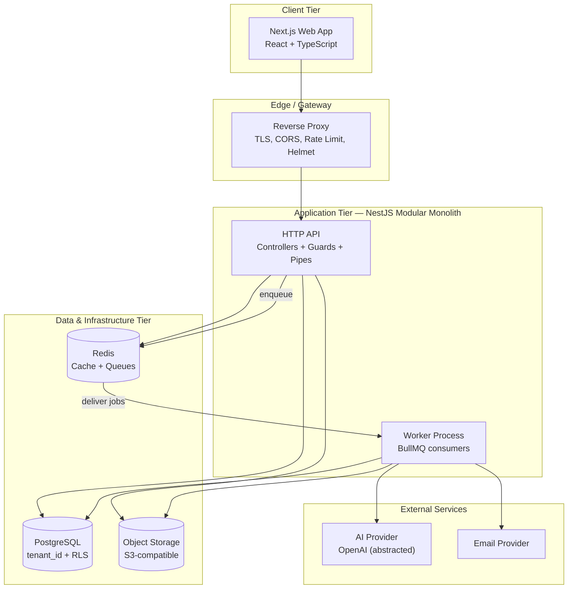

The web app talks only to the API through the edge proxy. The API serves requests synchronously and offloads anything slow (AI, exports, emails) to Redis-backed queues consumed by the worker. The app tier is stateless, so it scales horizontally.

### 2. Clean Architecture Layers

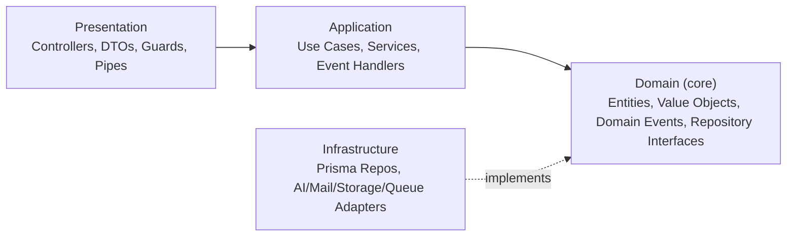

Dependencies always point inward toward the Domain. The Domain knows nothing about NestJS, Prisma, or HTTP. Infrastructure implements the repository/port interfaces the Domain declares, so adapters (e.g., the AI provider, the database) are swappable.

### 3. Folder Structure

```
timeforge/
├── apps/
│   ├── api/                        # NestJS HTTP application
│   │   └── src/
│   │       ├── main.ts
│   │       ├── app.module.ts
│   │       ├── config/             # typed env schema + ConfigService
│   │       ├── common/             # cross-cutting concerns
│   │       │   ├── guards/         # JwtAuthGuard, TenantGuard, PermissionsGuard
│   │       │   ├── interceptors/   # logging, response transform, timeout
│   │       │   ├── filters/        # global exception filter
│   │       │   ├── pipes/          # validation
│   │       │   ├── decorators/     # @CurrentUser, @RequirePermissions, @Tenant
│   │       │   ├── context/        # AsyncLocalStorage request/tenant context
│   │       │   └── events/         # domain event bus
│   │       ├── modules/            # one folder per bounded context
│   │       │   ├── auth/
│   │       │   ├── core-organization/  # CORE business context: depts, teams, projects, clients, settings
│   │       │   ├── users/
│   │       │   ├── rbac/           # roles, permissions, policies
│   │       │   ├── time-tracking/
│   │       │   ├── timesheets/     # smart timesheets (aggregate root)
│   │       │   ├── scrum/
│   │       │   ├── kpi/
│   │       │   ├── approvals/
│   │       │   ├── payroll/
│   │       │   ├── dashboard/
│   │       │   ├── notifications/
│   │       │   ├── ai/
│   │       │   ├── audit/
│   │       │   └── reports/
│   │       └── infra/
│   │           ├── prisma/         # schema.prisma, client, tenant middleware
│   │           ├── queue/          # BullMQ registration
│   │           ├── cache/          # Redis cache module
│   │           ├── storage/        # file storage adapter
│   │           └── mailer/
│   ├── worker/                     # BullMQ consumers (reuse api modules)
│   └── web/                        # Next.js (App Router)
│       └── src/
│           ├── app/                # routes, layouts, role-scoped pages
│           ├── features/           # UI per module (time, timesheets, scrum...)
│           ├── components/         # shared UI
│           └── lib/                # api client, auth, rbac helpers, hooks
├── packages/
│   ├── shared/                     # shared TS types, DTO contracts, enums
│   └── tsconfig/ eslint/           # shared configs
├── prisma/migrations/              # (Phase 3+)
├── docker/                         # Dockerfiles + compose
├── .github/workflows/              # CI/CD
└── package.json (workspaces)
```

Every module follows the same internal layering:

```
modules/<module>/
├── <module>.module.ts
├── api/            # controllers + DTOs            (Presentation)
├── application/    # services / use cases + handlers (Application)
├── domain/         # entities, VOs, events, repo interfaces (Domain)
└── infra/          # Prisma repository implementations + mappers (Infrastructure)
```

### 4. Module Boundaries & Dependencies

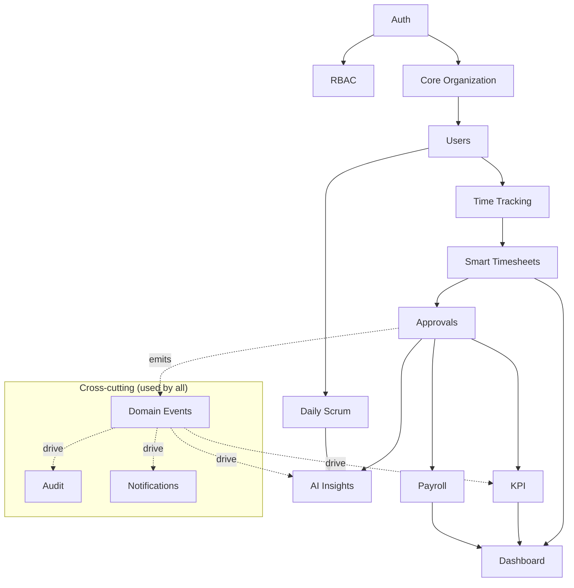

The core spine (Auth → Core Organization → Time → Timesheets → Approvals → Payroll → Dashboard → AI) is built first. Audit, Notifications, and the event bus are cross-cutting and consumed by every module.

### 5. Conceptual ERD (data ownership & relationships)

> Conceptual only — physical columns, indexes, constraints, audit columns, and migrations come in Phase 3. Every entity below also carries the standard `tenant_id`, `organization_id`, `created_by`, `updated_by`, `created_at`, `updated_at`, `deleted_at` (audit log excepted from soft delete).

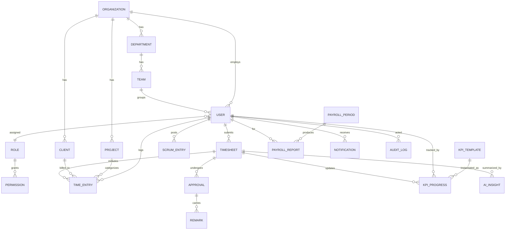

### 6. Request Lifecycle

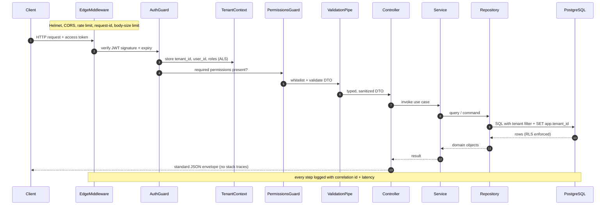

### 7. Tenant Isolation — Defense in Depth (4-step enforcement order)

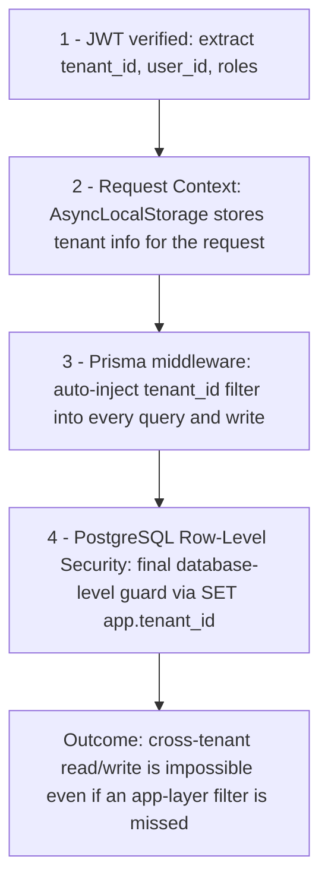

This is the system's most important invariant. Developers never hand-write tenant filters; layers 3 and 4 enforce it automatically, and layer 4 holds even if application code is wrong.

### 8. Authentication Flow

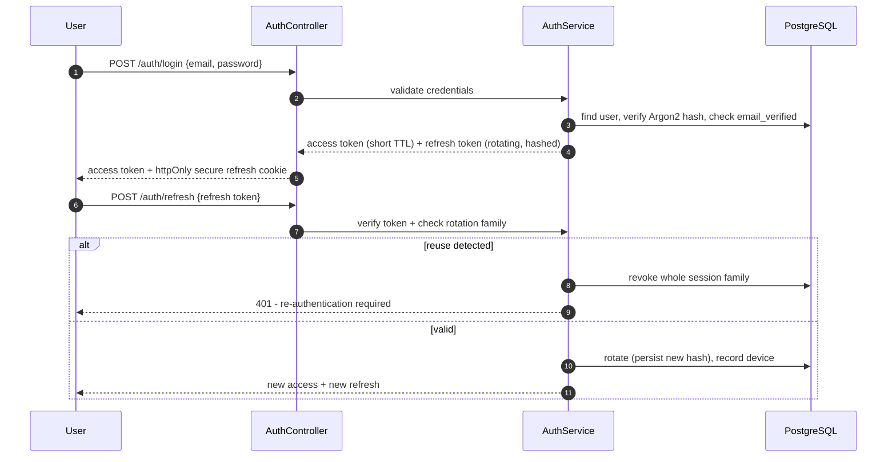

Registration/invite issues an email-verification token; forgot-password issues a short-lived reset token. Logout and admin action can revoke sessions. All auth events are audited.

### 9. Authorization (RBAC) Flow

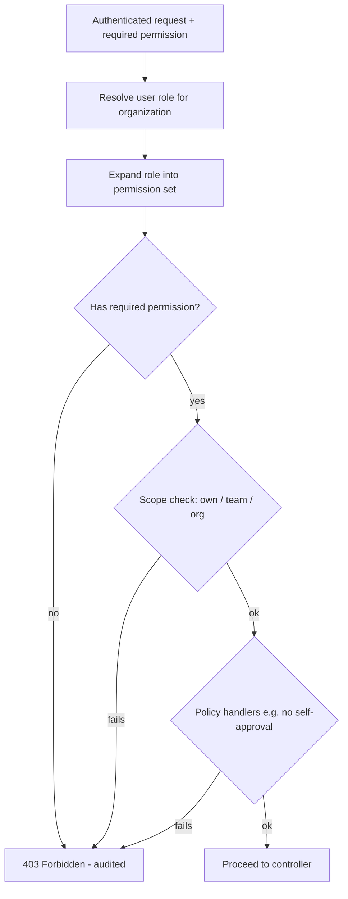

Authorization is permission-based and default-deny. Scope checks enforce the Phase 1 matrix (own / team / org), and policy handlers encode rules like BR-APP-04 (no self-approval).

### 10. Domain Events & Event Flow

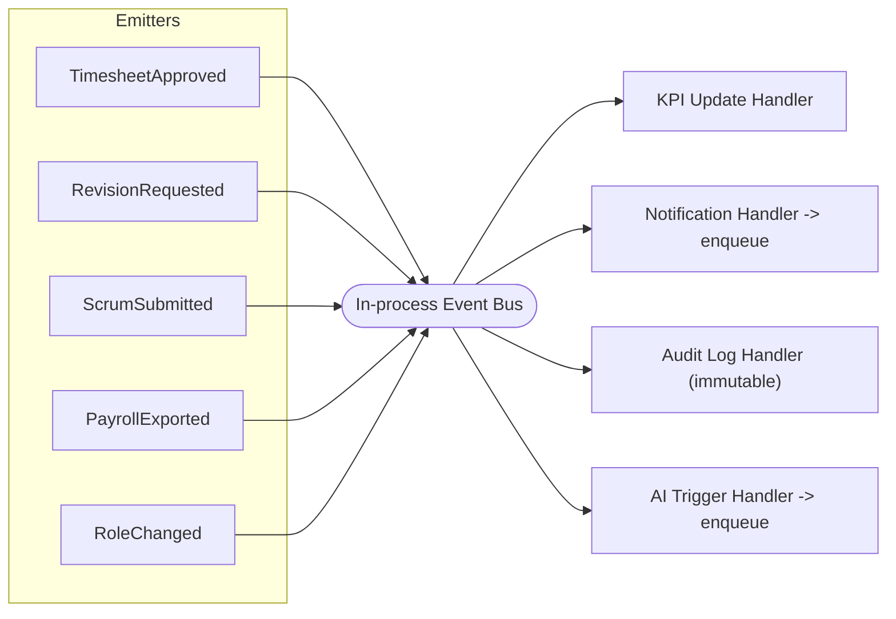

Modules communicate through events rather than calling each other directly. For example, approving a timesheet emits `TimesheetApproved`, which independently updates KPIs (BR-KPI-01), writes an audit record, notifies the employee, and may enqueue an AI summary — all without coupling the Approvals module to the others.

### 11. Background Job Architecture

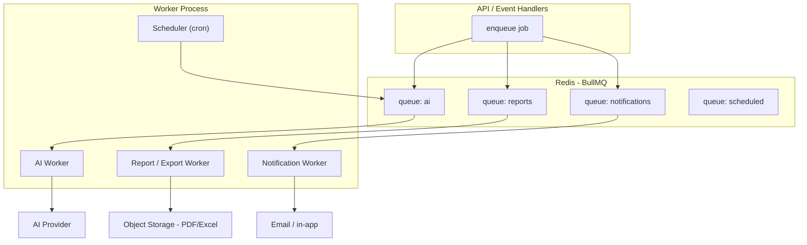

Queues separate concerns and allow independent retry/backoff. The scheduler enqueues recurring work (e.g., daily/weekly AI summaries, deadline reminders). Jobs are idempotent and tenant-scoped.

### 12. AI Service Architecture

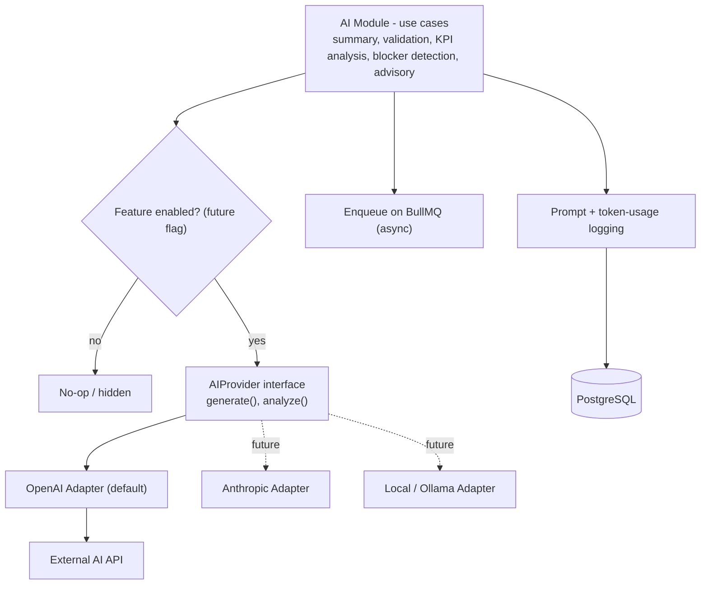

The AI module depends only on the `AIProvider` interface, so the concrete provider (OpenAI by default) is swappable. Every call logs the prompt, model, and token usage; calls run on the queue; outputs are advisory and reviewed by humans.

### 13. Caching Strategy

Redis (via `cache-manager`) caches read-heavy, recomputable data: dashboard aggregates, organization/config lookups, and resolved permission sets. Keys are **tenant-scoped** (`t:{tenantId}:...`) to prevent leakage; TTLs are short; caches are invalidated on the relevant domain events. Payroll figures and approval state are **not** cached (correctness over speed).

### 14. Logging, Error Handling & Validation

Logging is structured JSON via `pino`, with a correlation/request ID generated at the edge and carried through AsyncLocalStorage; every log line includes tenant ID, user ID, route, status, and latency, and security events are tagged. A **global exception filter** maps domain and framework errors to a standard envelope and never exposes stack traces:

```json
{ "error": { "code": "FORBIDDEN", "message": "…", "requestId": "…" } }
```

Status mapping: `400` malformed, `401` unauthenticated, `403` unauthorized, `404` not found / cross-tenant miss, `409` conflict (optimistic lock), `422` validation, `429` rate limit, `500` unexpected. Validation uses a global `ValidationPipe` (`whitelist`, `forbidNonWhitelisted`, `transform`) over class-validator DTOs, with Zod for dynamic/AI payloads; enums, UUIDs, dates, and lengths are validated and unknown fields are rejected.

### 15. Deployment Architecture

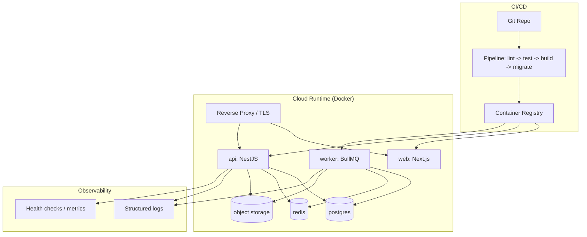

Local dev uses Docker Compose (web, api, worker, postgres, redis). Secrets come from environment variables / a secrets manager — never committed. CI runs lint, tests, and build; deploys run migrations before releasing new containers. Health checks and structured logs feed monitoring.

### 16. Approval State Machine

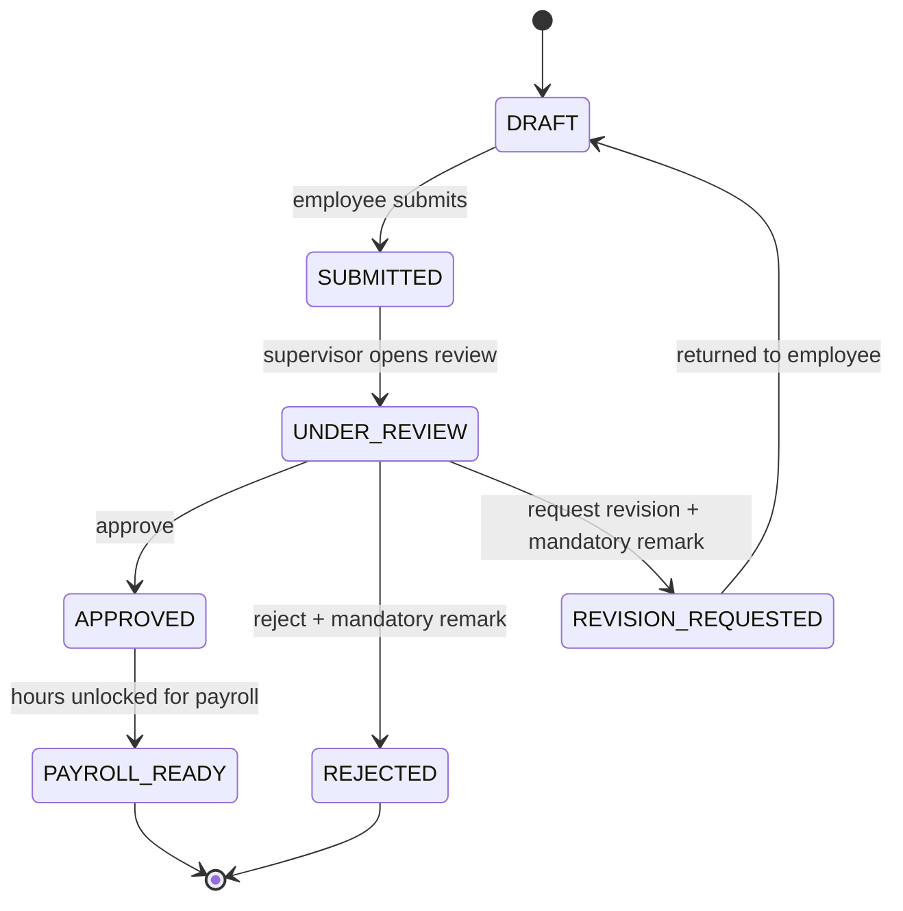

Only the transitions above are valid. **Any other transition is rejected at the application layer** — a state guard runs before persistence and returns `409 Conflict` / `422`. The payroll period follows the same discipline: `OPEN → LOCKED → EXPORTED`, where re-opening requires an explicit, audited action.

### 17. Transaction Boundaries

These operations must execute inside a **single database transaction** so they either fully succeed or fully roll back:

| Operation | Atomic unit |
|-----------|-------------|
| Submit timesheet | lock entries + create approval record + state → SUBMITTED + audit |
| Approve / Reject / Request revision | state transition + remark + `version` bump + audit |
| Payroll generation / export | aggregate approved hours + create payroll report + lock period |
| Role assignment / change | update user-role + invalidate permission cache + audit |
| User onboarding | create user + department/team/role assignment + audit |

**Domain events are dispatched only after the transaction commits** (after-commit / outbox dispatch), so no handler ever reacts to data that was later rolled back.

### 18. Concurrency — Optimistic Locking

Every mutable business row carries a `version INTEGER`. Updates are guarded:

```sql
UPDATE timesheet
SET ..., version = version + 1
WHERE id = :id AND version = :expectedVersion;
-- 0 rows affected -> concurrent modification -> 409 Conflict
```

This prevents lost updates and the double-approval race (two supervisors acting on the same submission at once). The `version` column is part of the standard audit columns defined in Phase 3.

### 19. Idempotency Strategy

Sensitive operations are safe to retry:

- **Client-triggered actions** (e.g., payroll export, bulk approve) accept an `Idempotency-Key` header; the key + result are stored, and a replay returns the original result instead of repeating the work.
- **Background jobs** use **deterministic job IDs** so BullMQ de-duplicates retries — e.g., `payroll:{periodId}:{userId}`, `ai-summary:{timesheetId}:{version}`, `notify:{eventId}:{userId}`.
- **Notifications and AI generation** are keyed to their triggering event/version, so a worker retry never sends a duplicate email or bills duplicate tokens.

### 20. API Versioning & Conventions

All endpoints are versioned from day one under `/api/v1/...` (NestJS URI versioning), so a future `/api/v2/` can coexist without breaking clients. Conventions: plural resource nouns, cursor/offset pagination on collections, the consistent error envelope from section 14, and tenant scope taken from the authenticated context — **never** from a client-supplied tenant ID.

---

## Security Notes

Defense in depth across the whole request path: TLS + Helmet + CORS allow-list + rate limiting + body-size limits at the edge; JWT auth with rotating, reuse-detected refresh tokens and Argon2 hashing; permission-based, default-deny authorization with policy handlers; the 4-layer tenant isolation chain (context → Prisma filter → Postgres RLS); parameterized queries via Prisma (SQL-injection safe); strict input validation that rejects unknown fields (XSS/over-posting); immutable audit logging of sensitive actions; secure, httpOnly cookies; and a global exception filter that prevents stack-trace and cross-tenant ID leakage. AI runs async, is provider-abstracted, logs tokens, and never auto-approves or edits payroll.

---

## Testing

The architecture is built to be testable per layer: domain logic is pure and unit-tested without infrastructure; application use cases are tested with in-memory repository fakes; controllers/guards/pipes get integration tests. Dedicated suites cover the **RBAC matrix** (every capability × role), **tenant isolation** (cross-tenant reads/writes must fail at the Prisma layer *and* be proven at the RLS layer), the **approval state machine** (valid vs invalid transitions), **payroll correctness** (reconciliation across period boundaries and overtime), **auth** (rotation + reuse detection), and **AI contract** tests against the provider interface with an outage/degradation path. Each diagram here maps to a test target in Phase 8.

---

## Risks

| Risk | Impact | Mitigation |
|------|--------|------------|
| RLS + Prisma middleware misconfiguration | Critical (leakage) | Treat as one feature; add explicit cross-tenant tests at both layers before any module ships. |
| Modular-monolith boundaries erode into a "big ball of mud" | Medium | Enforce per-module layering + dependency direction; communicate via events, not direct cross-module calls. |
| Worker/queue failures silently drop work | Medium | Idempotent jobs, retries with backoff, dead-letter handling, observability on queue depth. |
| AI latency/cost/outage | Medium | Async queue, token budgets, caching, graceful degradation; AI optional to the core flow. |
| Event-driven side effects hard to trace | Low/Med | Correlation IDs propagated into jobs/handlers; audit every state change. |

---

## Improvements (post-MVP, architecture already supports)

Extract high-traffic modules (e.g., Time Tracking, AI) into separate services; add read replicas and CQRS read models for dashboards; introduce an API gateway + per-service rate limits; SSO/SAML + SCIM; outbox pattern for guaranteed event delivery; OpenTelemetry tracing; blue/green or canary deploys; and turning on the feature-flag seam for per-org module rollout.

---

## Verification Checklist

**Completed**

- High-level system architecture, Clean Architecture layers, and folder structure defined.
- Module boundaries + dependency rules mapped (core spine + cross-cutting).
- Conceptual ERD delivered (physical model explicitly deferred to Phase 3).
- Request lifecycle, authentication flow, and authorization flow diagrammed.
- Tenant isolation documented as the 4-step defense-in-depth chain (per stakeholder recommendation).
- Domain-event flow, background-job architecture, and AI service architecture diagrammed.
- Caching, logging, error-handling, validation, and deployment architecture specified.
- All diagrams in Mermaid; **no implementation/business-logic code included.**
- Explicit approval **state machine** added; invalid transitions rejected at the application layer.
- **Transaction boundaries**, **optimistic locking** (`version`), **idempotency**, and **API versioning** (`/api/v1`) documented.
- Organization module renamed **Core Organization** (foundational business context).

**Pending (next: Phase 3 — Database Design)**

- Physical ERD with full attributes, data types, primary/foreign keys, unique + composite indexes, check constraints, audit columns, soft-delete strategy, optimistic-locking columns, RLS policies, seeders, and migration strategy.

**Locked decisions** (resolved; frozen)

- No partial approval (whole-timesheet); payroll immutable after export (adjust next cycle); KPI current-version-only; UTC storage with org tz for display. *(HR and Finance are two distinct roles.)*

**Risks:** see Risks section (RLS misconfig, boundary erosion, queue reliability, AI dependency).

**Improvements:** see Improvements section (service extraction, CQRS read models, SSO, outbox, tracing).

---

**STOP — Phase 2 complete. Awaiting your approval to proceed to Phase 3 (Database Design).**
