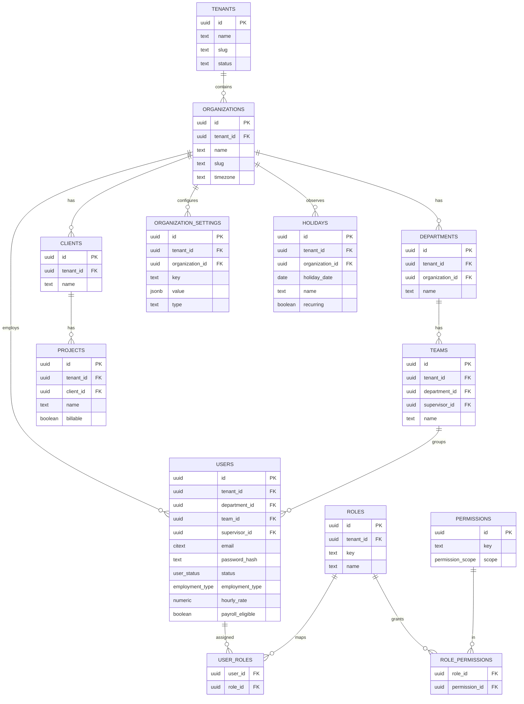
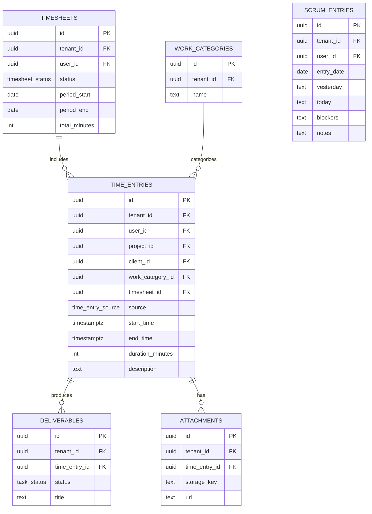
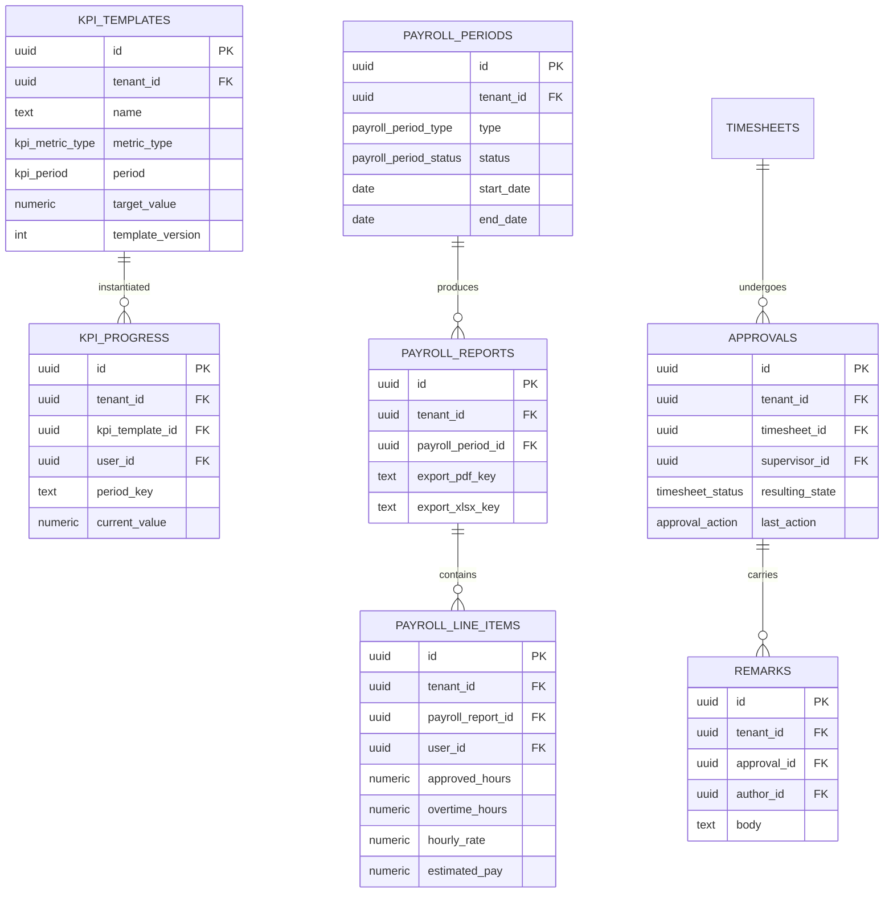
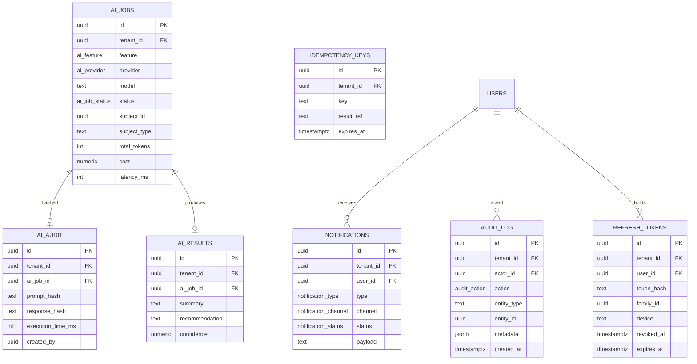

# TimeForge — Phase 3: Database Design

> The database contract for the entire system. Every later phase builds against this.
> PostgreSQL · shared schema + `tenant_id` · Row-Level Security · Prisma · UTC `timestamptz`
> Status: **DRAFT — awaiting approval before Phase 4 (API Specification)**
> Scope guard: schema/contract design only — no application/business-logic code.

---

## Goal

Define the complete physical data model: every table, column, type, key, constraint, index, enum, and relationship; how multi-tenancy is enforced at the database level (RLS + tenant-safe foreign keys); the audit and optimistic-locking columns carried by every business table; the performance design for dashboards and large lists; and the migration / seed / rollback strategy. This is the single source of truth Phases 4–9 implement against.

---

## Assumptions

1. Builds on approved Phase 1 (rules, RBAC, Org model) and Phase 2 (Clean Architecture, tenant isolation chain, state machine, transactions, optimistic locking, idempotency).
2. **`tenant`** is the isolation root; **`organization`** is the business aggregate (Core Organization) under a tenant. Both IDs live on every business row (Phase 1 hard rule). For a single-org deployment they are 1:1; the schema supports many orgs per tenant.
3. PostgreSQL 15+ (`gen_random_uuid()` available; RLS; partial & GIN indexes; `pg_trgm`).
4. The application connects with a **non-superuser** DB role (so RLS is never bypassed) and runs each request inside a transaction that sets `app.tenant_id`.
5. Money and rates use `numeric` (never float); durations are stored as **integer minutes** for exactness.
6. Soft delete is the default for business data; `audit_log` is append-only and never deleted.

---

## Architecture Decisions

| # | Decision | Rationale |
|---|----------|-----------|
| AD3-1 | **UUID v4 primary keys** (`gen_random_uuid()`). | No guessable sequential IDs across tenants; distribution-friendly. |
| AD3-2 | **`timestamptz`, stored UTC**; render in org/user tz. | Correct time math across DST/zones. |
| AD3-3 | **Native PG enums** for fixed domains; **lookup tables** for org-configurable sets (e.g., work categories). | Integrity for fixed sets; flexibility where the business configures values. |
| AD3-4 | **Standard columns on every business table** (see §1). | Uniform tenancy, audit, soft delete, optimistic locking. |
| AD3-5 | **Soft delete** via `deleted_at` + **partial indexes** `WHERE deleted_at IS NULL`. `audit_log` exempt. | Preserves history; keeps hot indexes lean. |
| AD3-6 | **Tenant-safe composite FKs**: child `(tenant_id, parent_id)` → parent `(tenant_id, id)`. | A row can never reference another tenant's row, structurally. |
| AD3-7 | **RLS ENABLED + FORCED** on every tenant table; policy keys on `current_setting('app.tenant_id')`. | DB-level final guard (Phase 2 layer 4). |
| AD3-8 | **Optimistic locking** via `version int`. | Prevents lost updates / double-approval. |
| AD3-9 | **Keyset (cursor) pagination** as default for large lists; bounded page sizes. | Stable, performant pagination at scale. |
| AD3-10 | **`numeric` for money/hours**, integer minutes for durations. | Exact financial + time math. |
| AD3-11 | **Prisma Migrate**, expand/contract pattern for destructive changes. | Reviewable, zero-downtime-friendly migrations. |

---

## Files Generated

| File | Purpose |
|------|---------|
| `docs/Phase-3-Database-Design.md` | This document — the physical database contract. |

No source code is generated in Phase 3 (schema/contract only).

---

## Implementation

### 1. Conventions & Standard Columns

Naming: `snake_case` tables (plural) and columns; enum types `snake_case`; PK `id`; FKs `<entity>_id`. Every **business table** carries these standard columns:

| Column | Type | Null | Notes |
|--------|------|------|-------|
| `id` | `uuid` | no | PK, `default gen_random_uuid()` |
| `tenant_id` | `uuid` | no | FK → `tenants(id)`; RLS key; on every row |
| `organization_id` | `uuid` | no | FK → `organizations(id)` (tenant-safe) |
| `created_by` | `uuid` | yes | FK → `users(id)` (null for system/bootstrap) |
| `updated_by` | `uuid` | yes | FK → `users(id)` |
| `created_at` | `timestamptz` | no | `default now()` |
| `updated_at` | `timestamptz` | no | `default now()`, app-maintained |
| `deleted_at` | `timestamptz` | yes | soft delete; `NULL` = active |
| `version` | `int` | no | `default 0`; optimistic lock |

Exceptions: `tenants` is the root (its `id` *is* the tenant; no `organization_id`); `audit_log` has only `created_at` (immutable, append-only — no `updated_at`, `deleted_at`, or `version`); pure join tables omit `version`/soft-delete where noted.

### 2. Enumerated Types

```
user_status            : INVITED | ACTIVE | SUSPENDED | DEACTIVATED
employment_type        : EMPLOYEE | INTERN | CONTRACTOR | PART_TIME | FULL_TIME
permission_scope       : OWN | TEAM | ORG
time_entry_source      : TIMER | MANUAL
timesheet_status       : DRAFT | SUBMITTED | UNDER_REVIEW | APPROVED | REJECTED | REVISION_REQUESTED | PAYROLL_READY
approval_action        : APPROVE | REJECT | REQUEST_REVISION
task_status            : NOT_STARTED | IN_PROGRESS | COMPLETED | BLOCKED
kpi_metric_type        : COUNT | HOURS | PERCENT | CURRENCY
kpi_period             : DAILY | WEEKLY | MONTHLY | PAYROLL_PERIOD
payroll_period_type    : FIRST_HALF | SECOND_HALF | CUSTOM
payroll_period_status  : OPEN | LOCKED | EXPORTED
hours_bucket           : APPROVED | PENDING | REJECTED | OVERTIME
notification_type      : SUBMISSION | APPROVAL_DECISION | REVISION_REQUEST | DEADLINE | PAYROLL_READY | AI_REPORT
notification_channel   : IN_APP | EMAIL
notification_status    : PENDING | SENT | READ | FAILED
ai_feature             : DAILY_SUMMARY | WEEKLY_SUMMARY | TIMESHEET_SUMMARY | PAYROLL_VALIDATION | KPI_ANALYSIS | BLOCKER_DETECTION | PRODUCTIVITY_INSIGHT | SUPERVISOR_ADVISORY
ai_provider            : OPENAI | ANTHROPIC | LOCAL
ai_job_status          : QUEUED | RUNNING | SUCCEEDED | FAILED
audit_action           : LOGIN | LOGOUT | APPROVE | REJECT | REVISION_REQUEST | PAYROLL_EXPORT | ROLE_CHANGE | PASSWORD_CHANGE | AI_USAGE | SETTINGS_CHANGE | ADMIN_ACTION
```

### 3. Physical ERD

Standard columns (§1) are implied on every business table and omitted from the diagrams for readability. Diagrams are split by domain cluster.

**Cluster A — Tenancy, Core Organization & RBAC**



**Cluster B — Time Tracking, Smart Timesheets & Daily Scrum**



**Cluster C — KPI, Approvals & Payroll**



**Cluster D — AI, Notifications, Audit & Auth**



### 4. Table Specifications (selected detail)

Below: domain-specific columns; **+ standard columns (§1)** are appended to every business table. Full column-by-column detail is given for the core lifecycle tables; peripheral tables list their distinctive columns.

**`tenants`** (isolation root) — `id` PK; `name`; `slug` (unique); `status`; `settings jsonb`; `created_at`, `updated_at`. No `tenant_id`/`organization_id`.

**`organizations`** — `name`; `slug`; `timezone text` (IANA). + standard. Unique `(tenant_id, slug)`. *(All tunable config moved to `organization_settings` below.)*

**`organization_settings`** (centralized config) — `key text` namespaced (e.g., `payroll.periods`, `payroll.overtime`, `schedule.workweek`, `schedule.expected_hours`, `ai.provider`, `ai.model`, `ai.toggles`, `ai.token_budget`, `notifications`, `theme`, `timezone`); `value jsonb`; `type text` (scalar / number / bool / json — drives the settings UI). + standard. Unique `(tenant_id, organization_id, key)`. Replaces the scattered Payroll/AI/Schedule settings with one table.

**`holidays`** (Holiday Calendar records) — `holiday_date date`; `name text`; `recurring boolean` (annual). + standard. Unique `(tenant_id, organization_id, holiday_date, name)`. Drives expected-hours / attendance / overtime (BR-SCHED-02).

**`departments`** — `name`. + standard. Unique `(tenant_id, organization_id, name)`.

**`teams`** — `department_id` FK; `supervisor_id` FK → users; `name`. + standard. Unique `(tenant_id, department_id, name)`.

**`clients`** — `name`; `contact jsonb`. + standard.

**`projects`** — `client_id` FK; `name`; `code`; `billable boolean`. + standard. Unique `(tenant_id, code)`.

**`users`**

| Column | Type | Null | Key / Notes |
|--------|------|------|-------------|
| `email` | `citext` | no | unique `(tenant_id, email)` |
| `password_hash` | `text` | yes | Argon2id; null for not-yet-activated invites |
| `status` | `user_status` | no | default `INVITED` |
| `first_name`, `last_name` | `text` | no | |
| `department_id` | `uuid` | yes | FK (tenant-safe) |
| `team_id` | `uuid` | yes | FK (tenant-safe) |
| `supervisor_id` | `uuid` | yes | FK → users (self) |
| `hourly_rate` | `numeric(12,2)` | yes | for payroll |
| `email_verified_at` | `timestamptz` | yes | gate access until set |
| `employment_type` | `employment_type` | no | operational dimension; default `EMPLOYEE`; interns = `INTERN` |
| `payroll_eligible` | `boolean` | no | default `true`; **interns seeded `false`**; payroll filters on this + `status = ACTIVE` (BR-PAY-05) |
| `hourly_rate` visibility | — | — | exposed **only to Finance/Admin** — never returned to the user themselves (BR-PAY-06) |
| + standard columns | | | |

**`work_categories`** (org-configurable lookup) — `name`; `description`. + standard. Unique `(tenant_id, organization_id, name)`.

**`time_entries`**

| Column | Type | Null | Key / Notes |
|--------|------|------|-------------|
| `user_id` | `uuid` | no | FK (tenant-safe) |
| `timesheet_id` | `uuid` | yes | FK; null while loose/running |
| `project_id` | `uuid` | yes | FK |
| `client_id` | `uuid` | yes | FK |
| `work_category_id` | `uuid` | yes | FK |
| `source` | `time_entry_source` | no | TIMER / MANUAL |
| `start_time` | `timestamptz` | no | |
| `end_time` | `timestamptz` | yes | null = running timer |
| `duration_minutes` | `int` | yes | derived; CHECK ≥ 0 |
| `description` | `text` | yes | |
| `reference_links` | `jsonb` | yes | array of URLs |
| + standard columns | | | |

Constraints: `CHECK (end_time IS NULL OR end_time > start_time)`; **one running timer per user** → partial unique index (see §7); tenant-safe FKs.

**`timesheets`** — `user_id` FK; `status timesheet_status` (default `DRAFT`); `period_start date`, `period_end date` (CHECK `period_end >= period_start`); `total_minutes int`; `submitted_at`, `decided_at timestamptz`. + standard.

**`deliverables`** — `time_entry_id` FK; `title`; `description`; `status task_status`; `kpi_template_id` FK (optional link). + standard.

**`attachments`** — `time_entry_id` FK; `storage_key` (object store); `filename`; `content_type`; `size_bytes int`. + standard.

**`scrum_entries`** — `user_id` FK; `entry_date date`; `yesterday text`, `today text`, `blockers text`, `notes text`. + standard. Unique `(tenant_id, user_id, entry_date)`.

**`kpi_templates`** — `name`; `description`; `metric_type kpi_metric_type`; `period kpi_period`; `target_value numeric`; `applies_to jsonb` (roles/departments); `template_version int`. + standard. Versioning: changes create a new `template_version` (history preserved; BR-KPI-02).

**`kpi_progress`** — `kpi_template_id` FK; `user_id` FK; `period_key text` (e.g., `2026-07` or `2026-W27`); `current_value numeric`; `target_value numeric` (snapshot). + standard. Unique `(tenant_id, kpi_template_id, user_id, period_key)`.

**`approvals`** — `timesheet_id` FK; `supervisor_id` FK; `last_action approval_action`; `resulting_state timesheet_status`; `acted_at timestamptz`. + standard. (Append a row per action for full history; the timesheet holds the current `status`.)

**`remarks`** — `approval_id` FK; `author_id` FK; `body text` (NOT NULL for REJECT/REVISION). + standard. **Never edited/deleted** (BR-APP-05): no `deleted_at` use; updates blocked at app + (optionally) a no-update trigger.

**`payroll_periods`** — `type payroll_period_type`; `status payroll_period_status` (default `OPEN`); `start_date`, `end_date` (CHECK ordered); `locked_at`, `exported_at timestamptz`. + standard. Unique `(tenant_id, organization_id, start_date, end_date)`.

**`payroll_reports`** — `payroll_period_id` FK; `generated_by` FK; `export_pdf_key`, `export_xlsx_key text` (object store); `totals jsonb`. + standard.

**`payroll_line_items`**

| Column | Type | Null | Notes |
|--------|------|------|-------|
| `payroll_report_id` | `uuid` | no | FK |
| `user_id` | `uuid` | no | FK |
| `approved_hours` | `numeric(8,2)` | no | CHECK ≥ 0 |
| `pending_hours` | `numeric(8,2)` | no | default 0 |
| `rejected_hours` | `numeric(8,2)` | no | default 0 |
| `overtime_hours` | `numeric(8,2)` | no | default 0 |
| `hourly_rate` | `numeric(12,2)` | no | snapshot |
| `estimated_pay` | `numeric(14,2)` | no | computed snapshot |
| + standard columns | | | |

**`ai_jobs`** — `feature ai_feature`; `provider ai_provider`; `model text`; `status ai_job_status`; `subject_type text` + `subject_id uuid` (polymorphic target, e.g., timesheet); `prompt_tokens int`, `completion_tokens int`, `total_tokens int`; `latency_ms int`; `cost numeric(12,4)`. + standard. **Execution metadata only — no raw prompt or response is ever stored.**

**`ai_audit`** (privacy-preserving) — `ai_job_id` FK; `prompt_hash text`, `response_hash text` (SHA-256 — gives integrity/traceability without retaining content); `execution_time_ms int`; `created_by uuid`. + standard. **Hashes only**, never raw prompts/responses; treated as immutable.

**`ai_results`** — `ai_job_id` FK; `summary text`; `recommendation text`; `confidence numeric(4,3)` (0–1). + standard. The surfaced, human-reviewed output (advisory only). Sensitive HR/payroll content is minimized to the summary actually needed.

**`notifications`** — `user_id` FK; `type notification_type`; `channel notification_channel`; `status notification_status`; `payload jsonb`; `read_at timestamptz`; `dedupe_key text`. + standard. Unique `(tenant_id, dedupe_key)` (idempotent sends).

**`audit_log`** (immutable) — `actor_id` FK (null for system); `action audit_action`; `entity_type text`; `entity_id uuid`; `metadata jsonb`; `ip text`; `created_at timestamptz`. **Only** `tenant_id` + `created_at` from the standard set — no `updated_at`/`deleted_at`/`version`. Append-only.

**`refresh_tokens`** — `user_id` FK; `token_hash text`; `family_id uuid` (rotation lineage); `device text`; `ip text`; `expires_at`, `revoked_at timestamptz`. + standard (no soft delete; revoke via `revoked_at`).

**`idempotency_keys`** — `key text`; `endpoint text`; `request_hash text`; `result_ref text`; `expires_at timestamptz`. + standard. Unique `(tenant_id, key)`.

### 5. Relationships & Cascade Rules

Default policy: **`ON UPDATE CASCADE, ON DELETE RESTRICT`** — business rows are soft-deleted, not hard-deleted, so RESTRICT prevents accidental orphaning. Exceptions:

| Child → Parent | On delete | Why |
|----------------|-----------|-----|
| `role_permissions` → roles / permissions | CASCADE | pure join table |
| `user_roles` → users / roles | CASCADE | pure join table |
| `refresh_tokens` → users | CASCADE | session data, no soft delete |
| `ai_audit` / `ai_results` → ai_jobs | CASCADE | child telemetry / output |
| `remarks` → approvals | RESTRICT | coaching history is permanent |
| `payroll_line_items` → payroll_reports | RESTRICT | financial integrity |
| everything else | RESTRICT | soft delete + audit instead |

### 6. Multi-Tenancy Enforcement

**`tenant_id` everywhere** (except `tenants`). **Tenant-safe FKs**: each parent has a composite unique `(tenant_id, id)`, and children reference `(tenant_id, parent_id)` → parent `(tenant_id, id)`, so a child can never point at another tenant's row even if application code is wrong.

**RLS** is enabled and forced on every tenant table:

```sql
ALTER TABLE timesheets ENABLE ROW LEVEL SECURITY;
ALTER TABLE timesheets FORCE ROW LEVEL SECURITY;

CREATE POLICY tenant_isolation ON timesheets
  USING      (tenant_id = current_setting('app.tenant_id', true)::uuid)
  WITH CHECK (tenant_id = current_setting('app.tenant_id', true)::uuid);
```

**Prisma middleware assumptions** (Phase 2 layers 2–3): per request/transaction the app runs `SET LOCAL app.tenant_id = '<uuid>'` (from the AsyncLocalStorage context), and Prisma middleware injects `tenant_id` into every `where` and every `create`/`update` payload. RLS (layer 4) is the backstop. The DB login role is **non-superuser** and not `BYPASSRLS`.

### 7. Indexes

Every FK is indexed. Key composite / partial / search indexes:

```
-- hot query paths (all tenant-leading)
time_entries     (tenant_id, user_id, start_time DESC)
timesheets       (tenant_id, status, organization_id)
timesheets       (tenant_id, user_id, period_start DESC)
approvals        (tenant_id, supervisor_id, resulting_state)
kpi_progress     (tenant_id, user_id, kpi_template_id, period_key)   UNIQUE
payroll_line_items (tenant_id, payroll_report_id, user_id)
notifications    (tenant_id, user_id, status)
audit_log        (tenant_id, created_at DESC)
audit_log        (tenant_id, actor_id, created_at DESC)

-- uniqueness / business rules
organizations    (tenant_id, slug)                                   UNIQUE
users            (tenant_id, email)                                  UNIQUE
roles            (tenant_id, key)                                    UNIQUE
user_roles       (tenant_id, user_id, role_id)                       UNIQUE
scrum_entries    (tenant_id, user_id, entry_date)                    UNIQUE
idempotency_keys (tenant_id, key)                                    UNIQUE
notifications    (tenant_id, dedupe_key)                             UNIQUE
org_settings     (tenant_id, organization_id, key)                   UNIQUE
holidays         (tenant_id, organization_id, holiday_date)          (index)
-- one running timer per user (BR-TIME-02)
time_entries     (tenant_id, user_id) WHERE end_time IS NULL         UNIQUE (partial)

-- soft-delete-aware partials on hot tables
time_entries / timesheets / approvals ... WHERE deleted_at IS NULL

-- search
time_entries.description, scrum_entries.* : GIN (pg_trgm) for ILIKE search
```

### 8. Check Constraints

```
time_entries        : end_time IS NULL OR end_time > start_time ; duration_minutes >= 0
timesheets          : period_end >= period_start ; total_minutes >= 0
payroll_periods     : end_date >= start_date
payroll_line_items  : approved_hours >= 0 AND overtime_hours >= 0 AND hourly_rate >= 0 AND estimated_pay >= 0
kpi_progress        : current_value >= 0
all business tables : version >= 0
remarks             : body <> '' (for reject/revision-linked remarks)
```

### 9. Performance

**Dashboard aggregation.** MVP computes metrics with indexed aggregate SQL (tenant-leading composite indexes above) and caches results in Redis (tenant-scoped keys, short TTL, invalidated on domain events). For scale: roll-up summary tables (e.g., `daily_user_hours`) maintained by the worker, or materialized views refreshed on schedule — i.e., a CQRS read model (deferred, architecture already supports).

**Pagination.** Keyset/cursor by `(created_at, id)` for large, append-heavy lists (time entries, audit log, notifications): `WHERE (created_at, id) < (:cursor) ORDER BY created_at DESC, id DESC LIMIT :n`. Offset pagination only for small admin lists. Page size is bounded server-side.

**Search.** `pg_trgm` GIN indexes for `ILIKE` on descriptions/scrum text; upgrade path to `tsvector` full-text if needed.

### 10. Audit Columns & Optimistic Locking

All mutable business rows carry the full standard set including `version` (§1). The application updates with `... WHERE id = :id AND version = :expected` and bumps `version`; a 0-row result → `409 Conflict` (Phase 2 §18). `created_by`/`updated_by` are set from the request context. `audit_log` is the immutable record of *what changed*; it is append-only and excluded from soft delete and versioning.

### 11. Migration, Seeds & Rollback

**Migrations.** Prisma Migrate; one reviewed migration per change; `migrate deploy` in CI before release. RLS policies, partial indexes, composite tenant-safe FKs, and `citext`/`pg_trgm` extensions are added via raw-SQL migration steps. Destructive changes use **expand → backfill → contract** (add nullable, backfill, enforce, later drop) for zero-downtime and safe rollback.

**Seeds (idempotent).** Permissions + roles + the Phase 1 permission matrix; a default tenant + organization; a bootstrap admin; sample departments/teams/clients/projects; default work categories; KPI templates; payroll settings (1–15, 16–EOM); a work schedule and holiday calendar. Seeded **access roles: Employee, Supervisor, HR, Finance, Admin**; sample interns are seeded as **Employee role + `employment_type = INTERN` + `payroll_eligible = false`**.

**Rollback.** Forward-fix preferred; keep `down` steps where safe; take a backup/snapshot before destructive migrations; never drop a column in the same release that stops writing to it.

### 12. Prisma Schema Excerpt (representative contract)

Illustrative only — shows the standard columns, an enum, tenant-safe composite mapping, and indexes (not the full schema):

```prisma
model Timesheet {
  id             String          @id @default(uuid()) @db.Uuid
  tenantId       String          @map("tenant_id") @db.Uuid
  organizationId String          @map("organization_id") @db.Uuid
  userId         String          @map("user_id") @db.Uuid
  status         TimesheetStatus @default(DRAFT)
  periodStart    DateTime        @map("period_start") @db.Date
  periodEnd      DateTime        @map("period_end") @db.Date
  totalMinutes   Int             @default(0) @map("total_minutes")
  createdBy      String?         @map("created_by") @db.Uuid
  updatedBy      String?         @map("updated_by") @db.Uuid
  createdAt      DateTime        @default(now()) @map("created_at") @db.Timestamptz
  updatedAt      DateTime        @updatedAt @map("updated_at") @db.Timestamptz
  deletedAt      DateTime?       @map("deleted_at") @db.Timestamptz
  version        Int             @default(0)

  entries        TimeEntry[]
  approvals      Approval[]

  @@unique([tenantId, id])                       // enables tenant-safe FKs
  @@index([tenantId, status, organizationId])
  @@index([tenantId, userId, periodStart])
  @@map("timesheets")
}
```

---

## Security Notes

The data layer is the final tenant guard: RLS forced on every table, tenant-safe composite FKs, a non-superuser app role, and `SET LOCAL app.tenant_id` per transaction make cross-tenant access structurally impossible even with buggy application code. UUID PKs prevent ID guessing/enumeration; `password_hash` stores Argon2id only; `refresh_tokens` store **hashes** with rotation families for theft detection; `audit_log` is immutable. **AI logging is privacy-preserving**: `ai_jobs` keeps execution metadata, `ai_audit` stores only SHA-256 hashes of prompt/response (never raw content), and `ai_results` retains the minimal human-reviewed summary — important because payroll, evaluations, and performance summaries are sensitive. All money/time use exact `numeric`/integer types to avoid rounding disputes. **Compensation privacy:** `hourly_rate` and computed pay are returned only to Finance/Admin — never to the employee themselves or to Supervisors/HR (BR-PAY-06). **Payroll inclusion** is an explicit flag filter — `payroll_eligible = TRUE AND status = ACTIVE` — not a role check, so interns and non-eligible workers are excluded by data, not by code branches.

## Testing

Schema-level tests planned for Phase 8: tenant-isolation tests proving cross-tenant `SELECT`/`INSERT`/`UPDATE` fail at **both** the Prisma filter and the RLS layer; FK tenant-safety tests (a cross-tenant FK insert must fail); the running-timer partial-unique constraint; check-constraint coverage (negative hours, bad time ranges); unique-constraint coverage (duplicate scrum per day, duplicate idempotency key); optimistic-lock conflict (concurrent update → 409); and migration up/down on a shadow DB in CI.

## Risks

| Risk | Impact | Mitigation |
|------|--------|------------|
| RLS bypass via superuser/`BYPASSRLS` role | Critical | App uses a restricted role; `FORCE RLS`; CI test asserts isolation. |
| Composite tenant-safe FKs add modeling overhead | Medium | Standardize via Prisma `@@unique([tenantId, id])` pattern + generator/snippets. |
| Soft delete + uniqueness interplay (re-using a deleted email/slug) | Medium | Partial unique indexes `WHERE deleted_at IS NULL`. |
| Dashboard aggregation cost as data grows | Medium | Indexed queries + Redis cache now; roll-up/MV read models later. |
| Enum evolution requires migrations | Low | Additive enum values are cheap; plan via migrations. |

## Improvements (post-MVP)

Partitioning of `audit_log` and `time_entries` by month; `daily_user_hours` summary tables / materialized views (CQRS read side); transactional **outbox** table for guaranteed event delivery; `pgvector` for AI semantic features; table-level encryption for sensitive columns; read replicas for analytics.

---

## Verification Checklist

**Completed**

- Conventions + standard columns (tenant_id, organization_id, created_by/updated_by, created_at/updated_at, deleted_at, version) defined and applied to all business tables.
- All enums enumerated; physical ERD delivered in 4 domain clusters with types/keys.
- Table specifications for the full lifecycle (tenancy, Core Organization, RBAC, time, timesheets, scrum, KPI, approvals, payroll, AI, notifications, audit, auth, idempotency).
- PK/FK + nullability + unique + composite indexes + check constraints + cascade rules specified.
- Multi-tenancy: tenant_id on every table, RLS policies (SQL), tenant-safe composite FKs, Prisma middleware assumptions.
- Audit + optimistic locking (`version`) documented; `audit_log` immutable.
- Performance (indexes, dashboard aggregation, keyset pagination, trigram search) and lifecycle (migrations, seeds, rollback) covered.
- Representative Prisma schema excerpt included as the contract pattern. No application/business-logic code.
- **AI logging redesigned for privacy**: `ai_jobs` (metadata) + `ai_audit` (prompt/response **hashes only**) + `ai_results` (minimal summary) — no raw prompt/response stored.
- **Centralized `organization_settings`** (key/value/type) replaces scattered config; `holidays` table added for the Holiday Calendar.
- **Role vs employment type separated**: `employment_type` enum + column added; payroll keyed on `payroll_eligible` + `status = ACTIVE`; access roles reduced to Employee, Supervisor, HR, Finance, Admin (Intern = Employee role + `INTERN` type).

**Pending (next: Phase 4 — API Specification)**

- REST endpoints per module (request/response shapes, status codes, validation rules, permissions, middleware, rate limits, pagination contracts, tenant scoping), OpenAPI-style. No implementation.

**Locked decisions** (resolved; frozen)

- HR and Finance are **two distinct seeded roles** — Finance owns payroll/rates/export; HR owns attendance/people reporting.
- **No partial approval** — a timesheet is approved/rejected as a whole (keeps `approvals` ↔ `timesheets` simple).
- **Payroll immutable after export** (`OPEN → GENERATED → APPROVED → EXPORTED/LOCKED`); corrections via next-cycle adjustment, never edits to exported data.
- **KPI templates: current version only** — no historical-versioning table in the MVP.
- All timestamps **UTC**; organization tz used for display/date-filter conversion only.

**Risks / Improvements:** see sections above.

---

**STOP — Phase 3 complete. Awaiting your approval to proceed to Phase 4 (API Specification).**
